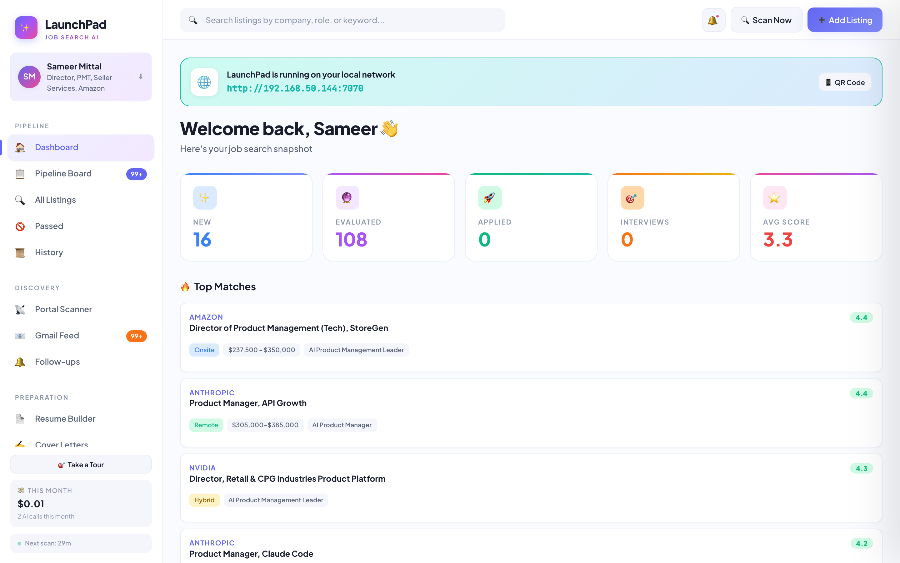
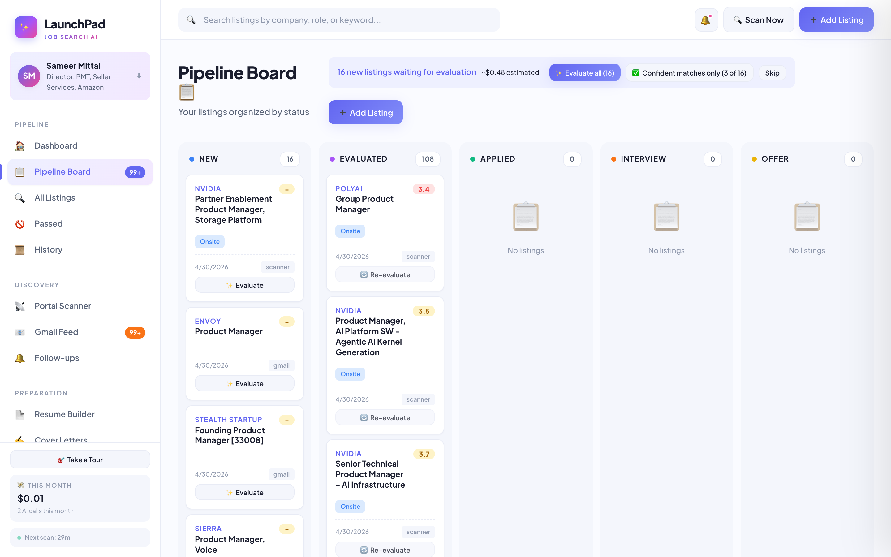
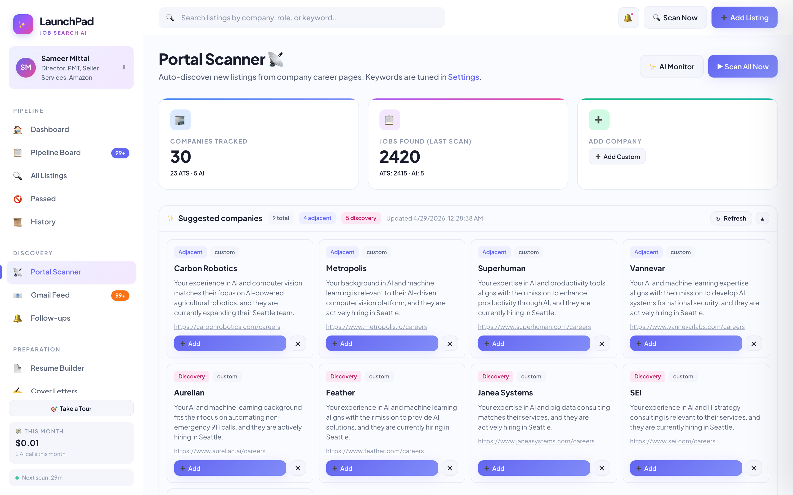
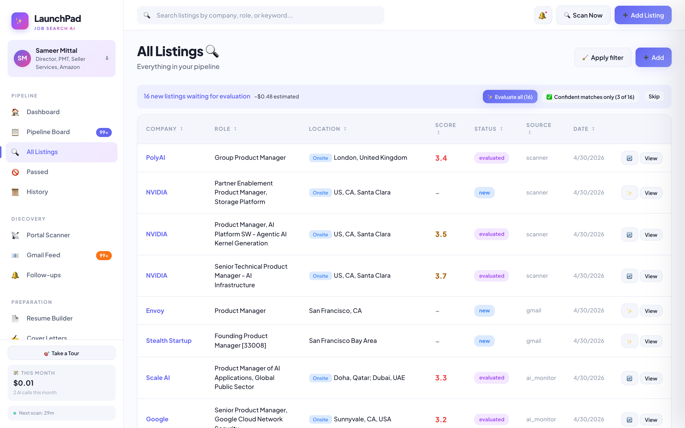
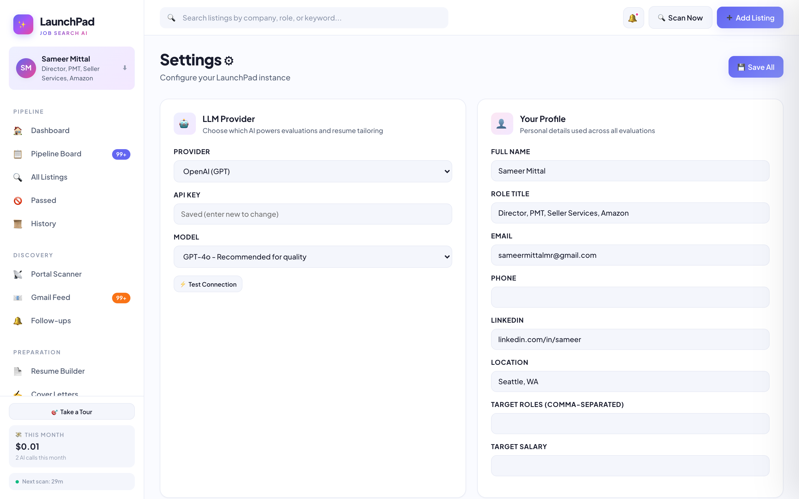
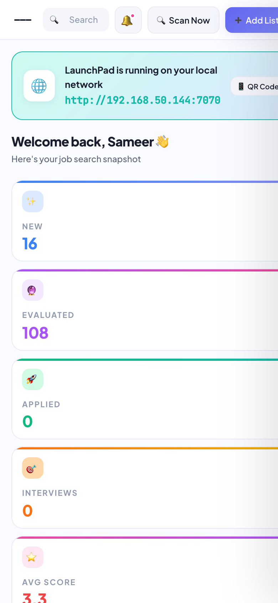

# LaunchPad

AI-powered job search command center. Run it once on your laptop or home server, browse it from any device on your local network.

## Screenshots

| Dashboard | Pipeline Board |
|---|---|
|  |  |

| Portal Scanner | All Listings |
|---|---|
|  |  |

| Settings | Mobile View |
|---|---|
|  |  |

## What it does

- **Discovers** jobs from portals (Greenhouse, Ashby, Lever, **Workday**) and your Gmail inbox (any sender — Indeed, LinkedIn, Glassdoor, Wellfound, etc.)
- **AI Company Monitor** — for companies without a public ATS (Amazon, Microsoft, Google, Apple, Meta, OpenAI, Anthropic), LaunchPad runs a resume-tuned web-search query plan on its own cadence. Uses **Gemini's Google Search grounding** for fresh, live results when configured.
- **Smart Title Filter** — optional LLM pass that classifies titles as yes/no/maybe before the expensive full evaluation. Catches synonyms ("Applied AI PM" without literal "AI" keyword) and drops obvious mismatches. ~$0.001 per title.
- **Batch Evaluate** — evaluate multiple listings at once with adaptive controls: "Evaluate all", "Confident matches only" (smart filter yes), "Top 10 by keyword", or "Maybe only"
- **AI-suggested companies** — daily list of 8-10 companies to consider tracking, half adjacent to what you track, half net-new discoveries; quick-add with one click
- **Evaluates** each listing with AI across **8 dimensions** (role, seniority, skills, comp, growth, s-curve, culture, location) using live web search to ground company-specific claims
- **Tailors** your resume and cover letter per job using LLMs, with a full-page editor for fine tuning
- **Conversational editor** — per-listing chat that can propose, apply, reject, and undo edits to both resume and cover letter in a shared thread (Wave 2)
- **Researches** each company (cached; auto-triggers before the first evaluation if research isn't already on file)
- **Pass history calibration** — after you've passed on 15+ roles with reasons, the evaluator factors that into future scores
- **Tracks** everything: pipeline, history, rejections, follow-ups, interviews, offers, passed listings
- **Multi-user**: Up to 3 profiles on one server instance, each with their own API keys and Gmail accounts
- **Mobile-friendly**: Responsive layout with hamburger sidebar, touch-friendly controls — works on phones and tablets
- **Guided onboarding**: Welcome wizard for first-time setup + 17-step feature tour accessible anytime from the sidebar
- **Cost tracking**: Sidebar widget with hover popover showing cost by feature and by provider

## Quick Start

### macOS / Linux

```bash
cd launchpad
./setup.sh       # First time only - installs deps + Playwright Chromium
./start.sh       # Start the server
```

### Windows

```cmd
cd launchpad
setup.bat
start.bat
```

Then open `http://localhost:7070` in your browser. The startup log will also show the URL to use from other devices on your network.

## Requirements

- Python 3.10+
- ~1GB disk space (for Playwright Chromium)
- LLM API key from Anthropic, OpenAI, or Google (configured in the UI after first login)
- Gmail account (optional, for inbox scanning)

## Deploying to a Desktop / Home Server

LaunchPad is designed to run on one machine (your desktop/NAS) and be accessed from any other device on your local network.

### Initial setup on the server machine

1. Copy (or `git clone`) the `launchpad/` folder to the server.
2. Run the setup script:
   - **macOS/Linux:** `./setup.sh`
   - **Windows:** `setup.bat`
3. Start the server:
   - **macOS/Linux:** `./start.sh`
   - **Windows:** `start.bat`
4. The startup log will print something like:
   ```
   Network:  http://192.168.1.42:7070
   ```
   That's the URL everyone else on your Wi-Fi can use from any device.

### Firewall

First time you start the server, your OS may prompt to allow Python to accept incoming connections. Click **Allow**.

- **macOS:** System Settings → Network → Firewall → allow `python` / `uvicorn`
- **Windows:** Windows Defender Firewall → Allow an app through firewall → Python
- **Linux (UFW):** `sudo ufw allow 7070/tcp`

### Port conflict

If port 7070 is already in use, edit `.env` and set a different port:
```
LAUNCHPAD_PORT=7171
```

### Per-machine data

LaunchPad stores everything as relative paths, so the install works across Mac/Windows/Linux without modification:
- `launchpad.db` (SQLite) sits next to the code
- `users/{id}/...` holds each user's resume, generated PDFs, and Gmail tokens
- `.launchpad.key` is the per-machine encryption key — **do NOT copy this between machines**

### Moving your data to a new machine

If you set up on your laptop first and want to migrate to the desktop server:

1. Copy the whole `launchpad/` folder to the desktop (or use the **Download Full Backup** button in Settings to get a ZIP of just your data).
2. On the new machine, **delete** the old `.launchpad.key` (a new one will be generated).
3. Run `setup.bat` / `./setup.sh` on the new machine.
4. If you used the ZIP, open Settings → Data & Backup → **Restore from Backup** and upload the ZIP.
5. Start (or restart) the server.
6. Open the app — your profiles, listings, resumes, and history are all there.
7. Go to Settings and **re-enter your LLM API key** (the old one was encrypted with the laptop's key, which you didn't copy).
8. Each Gmail account will need to be **reconnected** (same reason).

### Running it continuously

On a desktop you leave on, you'll want LaunchPad to auto-start and stay running. See [`scripts/README.md`](scripts/README.md) for:
- **macOS** — launchd plist template
- **Windows** — Task Scheduler steps
- **Linux** — systemd service template

### Verifying a fresh install

Run the smoke test to confirm all endpoints respond:

```bash
# macOS / Linux
bash scripts/smoke_test.sh

# Windows
scripts\smoke_test.bat
```

---

## Architecture

See [`.kiro/specs/launchpad/design.md`](../.kiro/specs/launchpad/design.md) for the full architecture.

- **Backend**: FastAPI + SQLite + SQLAlchemy + APScheduler
- **Frontend**: Vanilla HTML/CSS/JS — no build step required
- **Automation**: Playwright (PDF rendering + JS-heavy scraping)
- **Gmail**: Google OAuth + Gmail API (per-user credentials.json)
- **LLM abstraction**: one interface, three providers (Anthropic, OpenAI, Google Gemini) — each provider's native web-search tool is used for company research, evaluation grounding, AI Monitor queries, and suggestions. Optional dedicated Gemini key for Google Search grounding (fresh results for AI Monitor).
- **ATS parsers**: Greenhouse, Ashby, Lever, Workday (with auto site-slug discovery)
- **Background scheduler**: 5 recurring jobs — ATS scanner, Gmail sync, reminders, AI Company Monitor (own cadence), daily AI company suggestions refresh

### Data Storage

Everything is local:
- Database: `launchpad.db` (SQLite)
- User data: `users/{profile_id}/` (resumes, generated PDFs, Gmail tokens)
- Logs: `logs/`

All datetimes in the DB are stored as naive UTC. The API serializes them with an explicit `Z` suffix at the JSON boundary so any client (browser, curl, third-party) renders them in the correct local time.

Secrets (API keys, OAuth tokens) are encrypted at rest using a machine-local key.

---

## Known Issues & FAQ

### "How is each listing scored?"

The AI evaluator rates each listing on **8 dimensions** (0–5 each, decimals allowed):

| Dimension | What it measures |
|---|---|
| Role Match | Function + domain + responsibilities vs. your target roles |
| **Seniority** | Your level vs. the role's level, **adjusted for company size**. A Director at Amazon mapping to Staff/Principal at a 300-person scaleup is neutral-to-positive; same person to Senior PM at another FAANG is a down-title penalty. |
| Skills | Technical and domain overlap |
| Comp | Stated salary vs. your target (or typical benchmark if unstated) |
| Growth | Scope, trajectory, team ownership |
| **S-Curve** | Is this company at Amazon-2001 / Google-2003 inflection? Signals: funding velocity, revenue growth, headcount trajectory, category momentum, leadership pedigree, PMF indicators. |
| Culture | Values, pace, remote flexibility, recent signals |
| Location | Geographic fit |

Each dimension comes with a one-sentence rationale (hover the score in the detail panel). The overall score is a weighted average — you control the weights in Settings → Scoring Weights.

The summary also breaks down into **Take it if**, **Compromises**, and **Blockers** lists so you can quickly tell whether a role is worth a deeper look.

### "Is the evaluation using current data or stale training data?"

By default, **web-grounded**. The evaluator uses your LLM's native web search (OpenAI Responses API / Anthropic web_search / Gemini google_search) to ground company-specific claims — funding, headcount, recent news — in current reality rather than the model's training cutoff.

Cost trade-off: web-grounded eval adds ~$0.03-$0.05 per listing and 10-20s of latency. Toggle it off in Settings → Application Submission → "Web-grounded evaluations" if you want training-data-only evals at lower cost.

### "Why did Pinecone Staff PM score the same as VP at a FAANG for a Director-level candidate?"

It shouldn't now, after v2 of the evaluator. If you see this on a listing, look for the "_scored with the older v1 evaluator_" banner in the detail panel and click **Re-evaluate**. v2 adds explicit Seniority and S-Curve dimensions plus web search.

### "What's the difference between 'Passed' and 'Rejected'?"

**Rejected** (by company) — the company said no after you applied or interviewed. Lives in the Rejected column on the pipeline board.

**Passed** (by you) — you decided the role isn't right for you before applying. Click 🚫 in the detail panel to log a pass with a reason code: level_mismatch, comp_too_low, stage_mismatch, domain_mismatch, location, culture_fit, scope_too_narrow, founder_market_fit, timing, or other. Passes go to a dedicated **Passed** page under Pipeline.

### "How does the AI learn from my passes?"

Once you've logged **15 passes**, LaunchPad starts feeding that history (the reason codes + your notes) into every new evaluation as few-shot calibration signal. The LLM learns "this candidate consistently passes on IC-level roles" and scores accordingly. No fine-tuning, just dynamic prompt context.

You can review, delete, or exclude individual passes from calibration in Settings → **Pass History & Calibration**, or turn the whole thing off.

### "Tailoring rewrote my resume too much — can I control it?"

Yes. Open any tailored resume and click the ✏️ **Edit** button. You'll get a full-page editor with:
- Light / Medium / Heavy intensity pills (change and regenerate)
- Raw markdown textarea so you can hand-edit anything the LLM got wrong
- Live PDF preview that re-renders on Save (no extra LLM cost)
- A "Revert to original" button to restore the first AI version

Same flow works for cover letters (with tone selector instead of intensity).

### "Can I chat with the AI to refine my resume or cover letter?"

Yes. In either editor, click the **💬 Chat** button in the toolbar to open a side-by-side chat panel.

How it works:
- **One conversation per listing**, shared across both the resume and the cover letter. Ask for a tighter summary on the resume, then switch to the cover letter editor and the AI already knows the context.
- Each AI response proposes edits as **review cards** with a before/after diff, a target tag (resume / cover letter / both), and **Apply**, **Reject**, and **Refine** buttons. Nothing changes until you click Apply.
- **Undo** button rolls back the most recent applied edit. **Clear history** resets the thread for that listing.
- The conversation **persists per listing** across browser sessions — pick up tomorrow where you left off on any specific role. Other listings stay untouched.

**When NOT to use chat:** for trivial word swaps like "change 'built' to 'developed'" — just edit the markdown textarea directly. Chat is meant for substantive refinements ("tighten the opening paragraph", "lead with the Pinecone experience", "make the tone more technical"). If you type a trivial swap into chat, a small banner will nudge you to edit inline.

Toggle chat off (default) to get the simpler two-panel editor back. Visibility is remembered per-editor-kind.

### "The scanner doesn't find jobs at Amazon / Microsoft / Google / Meta / Apple"

Those sites don't use a public ATS API (Greenhouse/Ashby/Lever), so the scanner can't auto-discover listings there. Two workarounds, both built in:

1. **Paste job URLs manually** — the **➕ Add Listing** flow works on any public job page. The URL fetcher + LLM extraction handles the parsing.
2. **Set up a LinkedIn Job Alert** for that company. LinkedIn emails you matches, and LaunchPad's Gmail sync auto-extracts them into your pipeline. The Scanner page has a **"LinkedIn + Gmail Setup"** walkthrough that shows you exactly how.

Scanner adapters for SmartRecruiters, Teamtailor, and BambooHR are on the backlog.

### "Company research feels dated — does it use live data?"

Yes. Research calls use the native web-search tool on your chosen LLM provider (OpenAI Responses API, Anthropic `web_search_20250305`, or Gemini `google_search` grounding). If web search isn't available for your key/model, the service raises an error rather than returning training-data answers.

**Auto-research on evaluation:** whenever the evaluator runs on a listing from a company that doesn't have research yet (or whose cached research is older than 30 days), LaunchPad automatically runs the research pass *before* scoring and injects those findings into the evaluation prompt. That way `s_curve`, `growth`, `culture`, and the company-size piece of `seniority_match` are grounded in current reality on the very first eval. If the research call fails (no web search available, transient error), the evaluation still proceeds — it just logs a warning and falls back to the evaluator's own web search (if enabled).

If a company's existing research entry looks stale (it was cached before this change), click the **Refresh** button on the company card to regenerate.

### "My Anthropic/OpenAI/Google key isn't working"

- Make sure you saved the key on the Settings page and clicked Save. The card shows "Saved" once it's stored (encrypted).
- Click **⚡ Test Connection** on the Settings page to verify the key with a tiny round-trip.
- For OpenAI, the pinned SDK version is `2.32.0`. If you see SDK incompatibility errors, re-run `setup.sh` / `setup.bat`.

### "Gmail connect says 'credentials not configured'"

Each user uploads their own Google OAuth credentials.json (we don't ship shared credentials):

1. Go to `console.cloud.google.com` → create a new project
2. Enable the Gmail API
3. OAuth consent screen → External → add your Gmail address as a test user
4. Credentials → Create OAuth client ID → Desktop app
5. Download the JSON and upload it in **Gmail Feed → Show Setup Instructions**

There's a step-by-step walkthrough on the Gmail page.

### "PDF generation fails on Windows"

Playwright Chromium handles PDF rendering, so there's **no GTK / WeasyPrint dependency**. The only Windows gotcha is the first-time Playwright install:

```cmd
.venv\Scripts\activate.bat
python -m playwright install chromium
```

`setup.bat` does this automatically. If it fails (corporate proxy, etc.), re-run just that command in an elevated terminal.

### "The app is slow on first listing"

First run warms up:
- LLM evaluation (~15–30s depending on model + JD length)
- Resume tailoring (~30–50s)
- Cover letter generation (~20–30s)
- PDF rendering (~2–5s per file)

Typical total: ~60–90s from paste-URL to ready-to-review PDF. Subsequent listings reuse the model warmup and are faster.

### "Scanner catches too many junior roles"

Open Settings → **Portal Scanner Filter** and tune your positive / negative keywords. Or click **Smart Setup** on the Resume page to let AI generate them from your resume. For more precision, enable the **Smart Title Filter** in Settings — it adds a tiny LLM pass (~$0.001/title) that classifies each title as yes/no/maybe, catching synonyms and dropping obvious mismatches that keyword matching alone would miss.

### "I broke something — how do I start over?"

Settings → **Data & Backup** → **Download Full Backup** first. Then:
- **Reset scanner only**: Settings → Portal Scanner Filter → Reset to defaults
- **Reset profile only**: Settings → Danger Zone → Delete This Profile
- **Full nuke**: stop the server, delete `launchpad.db`, `users/`, and `.launchpad.key`, restart.

### "I've added companies that aren't on Greenhouse/Ashby/Lever. Can LaunchPad still discover jobs there?"

Yes — that's what **AI Company Monitor** is for. Toggle it on for any tracked company and LaunchPad will:

1. **Generate a 3-5 query plan** tuned to your resume + target roles + pass history + that company's title hierarchy (web-grounded so level mapping like "Director at Amazon ≈ Staff PM at a 300-person scaleup" stays current)
2. **Run those queries** through your LLM provider's native web search on its own cadence (default daily — configurable under Settings → AI Monitor Interval)
3. **URL-dedupe** new listings by platform-specific stable IDs (Amazon jobs IDs, Greenhouse slugs, Ashby UUIDs, etc.)
4. **Apply your title filter** — rows that fail your positive/negative keyword rules are kept visible under "Filtered by your rules" with an **Add anyway** button, so nothing is silently hidden outside LaunchPad
5. **Auto-evaluate** kept listings through the normal pipeline

You can view the query plan per company, edit individual queries (add / remove / rewrite inline), force-regenerate, or scan on demand. All from the Scanner → **AI Monitor Details** modal.

### "How does Suggested Companies work?"

The strip above the Scanner table refreshes daily at 5am, producing 8-10 companies the AI thinks you should consider tracking. Half are **adjacent** (similar to companies you already track) and half are **discovery** (emerging names or notable scale-ups in your space). Each card shows name, a one-line "why relevant to you" rationale, and the verified careers URL.

- **➕ Add** converts the suggestion into a tracked company in one click — platform auto-detected
- **✕ Dismiss** tells the AI to never suggest that company again; dismissed names get fed into the next LLM call as negative signal so the list naturally improves over time
- **↻ Refresh** regenerates on-demand with a 4-hour cooldown (with a live HH:MM:SS countdown so you can see when it's available again)

Web-grounded: the AI verifies each careers URL and checks the company is actively hiring before suggesting it.

### "What is the Indeed MCP probe, and should I run it?"

Indeed has an MCP (Model Context Protocol) server at `mcp.indeed.com` that's currently gated behind a client allowlist — only Anthropic's Claude client is authorized. We shipped a standalone probe script (`launchpad/scripts/indeed_probe.py`) that exercises the full OAuth 2.1 flow (discovery → dynamic client registration → authorization code + PKCE → token exchange → MCP initialize) so the day Indeed opens the allowlist, the probe flips from `403 invalid_client` to working, and we can wire it into the scanner.

For now: use **Indeed Job Alerts → Gmail**. Set up a native Indeed alert in your Indeed account; the Gmail extractor already recognizes `alert@indeed.com` as a trusted job-alert sender (Settings → Trusted Job-Alert Senders).

### "How much do LLM calls cost?"

Approximate ballpark per listing (GPT-4o or Claude Sonnet tier):
- Evaluation (web-grounded, 8 dimensions): ~$0.02–$0.05
- Resume tailoring: ~$0.02–$0.05
- Cover letter: ~$0.01–$0.03
- Company research (web-search, cached 30 days): ~$0.03–$0.08 — runs automatically before the first evaluation for a new company
- Conversational editor (per chat turn): ~$0.01–$0.03
- AI Company Monitor query-plan generation: ~$0.02–$0.05 per company (cached 30 days or until you click Regenerate)
- AI Company Monitor scan: ~$0.05–$0.20 per company per scan (default daily; configurable)
- AI Company Monitor scan (Gemini grounded): ~$0.01–$0.03 per company per scan (fresh Google results)
- Smart Title Filter: ~$0.001 per title (~$0.015 per batch of 15)
- Daily company suggestions refresh: ~$0.02–$0.05 per day per profile

The sidebar shows cumulative usage. If you want hard limits, set a project-level cap directly with your LLM provider.

---

## Attribution

LaunchPad reuses ideas and components from:
- [career-ops](https://github.com/santifer/career-ops) (MIT) — evaluation prompts, portal scanner logic, HTML resume template
- Internal `job-agent` project — Gmail OAuth flow and Playwright form filler

## License

MIT
